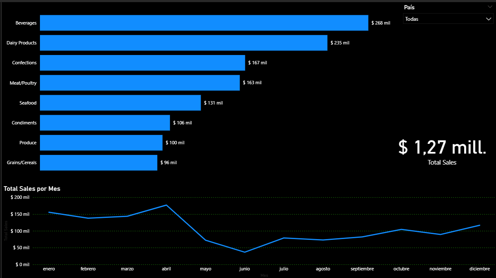
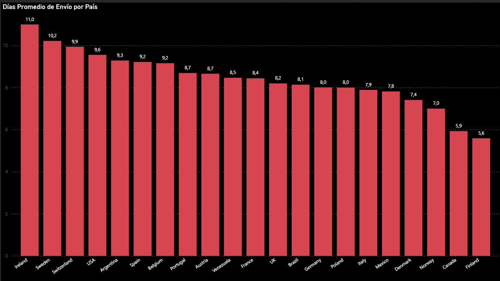

# 📊 Proyecto de Análisis End-to-End: Northwind Traders

Este proyecto presenta un ecosistema de datos integral sobre la base de datos **Northwind**. El flujo de trabajo abarca desde la extracción y modelado en **SQL**, pasando por el monitoreo operativo en **Power BI**, hasta el análisis avanzado de estacionalidad y predicción con **Machine Learning** en **Python**.

---

## 💡 Conclusiones del Análisis de Negocio

Tras integrar las diferentes fuentes de análisis, se han extraído los siguientes *insights* estratégicos para la toma de decisiones:

* **Crecimiento Sostenible:** El modelo de **Regresión Lineal** valida una tendencia positiva en los ingresos. Se proyecta que las ventas mensuales superarán la barrera de los **$100,000** en el corto plazo, lo que sugiere una oportunidad para expandir la capacidad operativa.

* **Gestión de Estacionalidad:** Se identificó un pico crítico de ventas los **viernes de abril ($50,301)** y una caída significativa los **miércoles de junio ($4,602)**. Esto permite planificar campañas de reactivación específicas para los periodos de baja demanda.

* **Eficiencia Logística:** Existe una brecha de rendimiento en envíos entre países. Mientras que **Finlandia** es el más eficiente (5.6 días), **Irlanda** presenta el promedio más alto (11 días), señalando un punto de mejora necesario en la cadena de suministros internacional.

* **Mix de Productos:** La categoría **Beverages** es el motor principal de la empresa con **$268,000** en ventas totales, consolidándose como el producto líder para estrategias de fidelización.

---

## 📂 Evidencias del Proyecto

A continuación, se presentan las pruebas técnicas que respaldan las conclusiones anteriores.

### 1. Analítica Predictiva (Python & Machine Learning)
Se utilizó **Scikit-learn** para entrenar un modelo que interpreta la tendencia histórica y proyecta el comportamiento futuro.

### 2. Análisis de Estacionalidad (Python & Seaborn)
Mapa de calor generado para detectar patrones de compra por día de la semana y mes del año, permitiendo identificar momentos de saturación y oportunidad.

### 3. Dashboard Operativo (Power BI)
Visualización de KPIs críticos como el rendimiento logístico por país y la distribución de ingresos por categoría de producto.

### 4. Capa de Datos (PostgreSQL)
La base del proyecto reside en una estructura sólida de SQL. Se desarrollaron scripts avanzados para auditoría y preparación de datos:
* [Análisis de Mercados Internacionales](sql/01_clientes_y_pedidos_internacionales.sql)
* [Auditoría de Proveedores y Catálogo](sql/02_auditoria_productos_y_proveedores.sql)
* [Elasticidad de Descuentos](sql/03_analisis_ventas_y_descuentos.sql)
* [Vistas Analíticas para Python](sql/04_vistas_analiticas_para_python.sql)

---

## 🛠️ Tecnologías Utilizadas
* **PostgreSQL:** Extracción de datos, Triggers y Vistas analíticas.
* **Python (Pandas, Scikit-learn):** Procesamiento de datos y modelado predictivo.
* **Power BI:** Visualización de datos y DAX.
